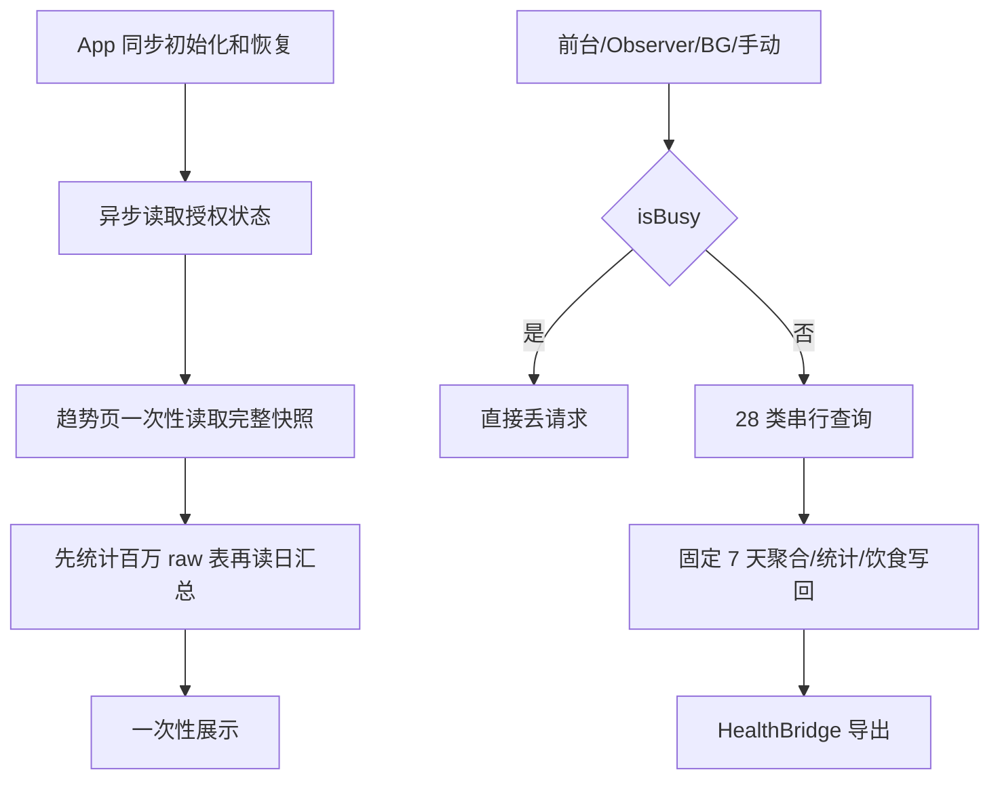
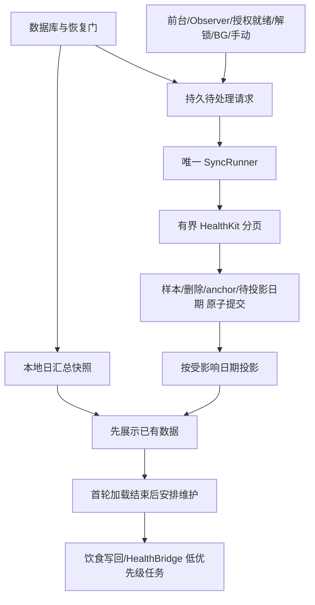

# 详细设计：展示优先、可恢复的增量同步

状态：Proposed。用户请求设计交接；生产实现尚未开始。代码命名为建议接口，只有对应阶段通过后才视为已存在。

## 1. 目标、范围与证据

目标 A：已有本地数据的冷启动，不因 HealthKit、全表元信息或外部导出而等待；页面可以先展示带日期的上次数据。

目标 B：前台、observer、解锁、后台、手动触发共享可靠调度，事件在忙碌/取消/进程中断时可恢复。

目标 C：常态成本随新增/删除数据与受影响日期增长；降低零变化循环和导出重复 I/O。

保持：HealthKit 全类型覆盖和全部来源采集；既有饮食证据、活动能量归因、睡眠统计口径；同 Bundle ID、签名、备份/恢复与 HealthBridge 协议。

不在本轮扩大：新传感器、新的健康推断、修改睡眠归日口径、24 小时准时后台 SLA、云端服务、删除历史、重装清库、LLM 分析、发布。

依据见 `../ASSESSMENT.md`。已知规模约 360 万 raw / 1.94 GB；busy 丢请求由原方法探针复现；23 次 HealthKit protected-data 错误来自手机任务记录。Mac 查询耗时与 iPhone 首屏时间严格分开。当前 anchor 28 个齐全，日常不是每次全量回补。

## 2. 现状与问题位置

首屏 SQL 在 `DashboardData.swift`；busy guard、提前 completed 和后处理在 `SyncEngine.swift`；HKQuery 的无取消 continuation 在 `HealthKitManager.swift`；`RootView` 负责授权后启动 observer；HealthBridge 每次前台扫描所有 outbox payload。

## 3. 目标结构与责任

| 模块 | 责任 | 明确边界 |
|---|---|---|
| DashboardLoader / View | 读取本地展示快照，保留旧快照，合并刷新 | 无 HK 查询、无外部导出等待、无不展示的全量 raw 统计 |
| StartupMetrics | 记录初始化、恢复、快照可用的单调时钟阶段 | 不记录健康值/凭据；快照可用不冒充首个渲染帧 |
| SyncSchedulingState | 纯值状态：请求合并、代次、ready/deferred/running | 无数据库、HealthKit、Task 或 UI 副作用 |
| SyncFailurePolicy | 将错误归为等待解锁、取消、暂时失败、授权相关、需修复 | 不靠本地化字符串判断错误，不推断读授权 |
| HealthKitQueryExecutor | 生命周期、deadline、取消、exactly-once continuation | 底层 query 取消和超时必须释放；不读取数据库 |
| SyncWorkStore | durable demand、dirty dates、页提交与恢复 | 高风险事务边界由 Planner 主导 |
| IncrementalSyncCoordinator / SyncPageRunner | 按类型分页，调用 mapper/store，汇总结果 | 不管理 SwiftUI 状态；不悄悄重置 anchor |
| SyncRunner / SyncEngine | 一个实际执行通道；engine 是兼容 UI facade | 覆盖历史回补/手动调用，防止旧入口绕过通道 |
| ProjectionWorker / DailyAggregator | 读取受影响日期并更新本地投影 | 保持当前来源/睡眠/营养计算口径 |
| HealthKitObserver / BG scheduler | 把系统事件提交给 runner，正确结束系统回调 | 不自己再起另一套同步循环 |
| ManualSyncCoordinator | 两次请求间等待用户外部同步，合并最终类型状态 | 等待用户时不持有执行锁 |
| HealthBridge | 只读取待发布 payload，维护任务有界 | 保持字节、哈希、回执、重放和保留期合同 |

不增加通用任务框架、DI 容器或插件系统。协议只放在真实外部边界：HK query、时钟、持久工作存储、projection executor。能用闭包测试的简单依赖使用闭包。

## 4. 首屏策略

### 4.1 首先删除实际无用途的昂贵工作

S01 移除 DashboardSnapshot 未使用的 `rawSampleCount/lastIngest` 和相应 COUNT/MAX。保留质量详情的现有查询及语义，不顺手修改索引或 MAX 的业务含义。真实 loader 测试在隔离 fixture 去除 raw 表后仍能读出日汇总；不是通过 mock loader 验证。

保留一个一致的本地快照事务；第一轮不把每张卡片拆成独立 DB 请求，以免营养/能量卡片来自不同数据版本。

### 4.2 展示与后台活动解耦

首屏不 await HK 同步、饮食写回、HealthBridge、备份导出。保留 DB 开启/必要 schema/启动恢复门。已有权限请求历史时，授权状态 `.unknown` 只表示检查中，允许展示已有本地记录；首次安装没有请求过权限时保留 onboarding。该分流是本地展示策略，不能据此开放 HK 查询或伪称已授权。

刷新失败保留旧快照并显示失败/重试；没有旧快照时显示加载错误，不用空数据或全零冒充成功。刷新代次确保慢的旧请求不覆盖新的快照。首批只有一轮主动读取；同步事件只在投影内容变化时请求刷新。

S02 先记录基线；S08A 调整 RootView/启动展示策略；S11B 把维护工作移到首轮快照成功或失败已结束之后。当前页面未加载（后台启动）时不等待 UI：按系统工作预算运行必要同步，把维护持久待办留待后续合法触发。不能用固定 1 秒 sleep 作为“首屏结束”。

### 4.3 缓存的取舍

第一轮不加入新的磁盘快照缓存。现有日汇总就是持久读模型，先用它消除大表扫描。若真机仍未达目标，再单独评审受保护、带 schema/projection/timezone 版本的显示缓存；不能把健康数据复制到未保护的 UserDefaults 或普通公共文件。

## 5. 请求调度策略

所有请求以“类型集合 + 原因 + 代次”表达。前台请求、授权就绪、解锁都可请求一次全类型检查；observer 只标记其类型。类型覆盖基于现有 HealthKitTypeCatalog，不过滤来源，不根据空结果永久关闭某类型。

首版并发度固定为 1，先保证有界与可恢复；后续只有真机数据支持才单独试验 2–4 路查询。忙碌时记录 pending；runner 当前工作结束后读取 pending，而不是丢弃，也不是为每个通知创建一次完整扫描。

foreground + authorization-ready 对同一次启动合并为同一个 intent；重复 SwiftUI 回调不能形成无限循环。HK observer 在某类型 query 开始后到达的通知保守要求后续轮次；允许额外一轮，但不允许漏数据。具体代次和 drain 规则见 C02/C03。

起始预算供试验，不是平台保证：页面 limit=1000；单 query deadline=8 秒；前台一次执行 slice≤8 秒或8页，先到先让出；background slice≤5 秒或4页，并随系统 expiration 立即终止；暂时错误跨 slice 退避 1/3/10 秒，单一活跃类型不得饥饿阻塞其他类型。预算通过可注入 clock 测试。受保护数据不可读整轮延后，不给 28 类各自连试三遍。

## 6. 持久化、分页与投影

新增 pending/dirty 记录，并与原始页提交事务配合；schema 见 C04/C05。只有页数据/删除/anchor/dirty dates 一起提交后，该页才可称持久完成。最后非空页之后还需查询空页确认 drain，不用“返回条数<limit”推断完成，删除分页同样算工作。

日投影覆盖真正受影响的历史日期，替代固定 7 天。保持现有 sleep 的 start-day 桶和当前来源优先级；跨午夜仅扩大重算集合，不在本优化中改归日算法。活动能量变动还要加入与变更区间重叠的 workout 所属日；一次类型/日期变化可能影响多个卡片。规则见 C06。

展示发布点是本地投影成功提交；HealthKit 读取完成不直接发送“全部成功”。可先发布已成功日期，其余保持 pending/error，并显示部分完成。无变化不重算，不 bump aggregationTick，不产生无意义 Bridge 更新。

## 7. 生命周期与权限

保留 BGTask handler 在启动结束前注册且每个 identifier 一次的合同。Observer 启动从 RootView 转到 AppEnvironment 生命周期服务，完成恢复后独立于页面创建；系统授权/数据可读状态异步确定后补发原来等待的 intent。

同时关注前台和 `UIApplication.protectedDataDidBecomeAvailableNotification`；后者只是触发器，实际 HKQuery 仍可能报不可读，继续 deferred。请求是否处理完成、数据是否存在、读权限是否授予是不同概念。空查询是合法结果，不能等同授权拒绝。

后台 completion/expiration 的所有权见 C07。必须测试取消发生于 execute 前、execute 后、callback 前后及超时同一刻的竞态，不能仅用 Task.cancel + defer 表面释放锁。

## 8. 手动同步、回补和导出

手动普通刷新复用同一个调度器。现有“去外部 App 同步再回来”的两次流程保持可访问，等待用户时释放执行通道；其他自动数据可正常同步。父 manual job 可以跨两次请求统计，子同步执行各自记录真实结果；不需要给旧 sync_jobs 新增 parent 外键。第二轮某类型成功（包括零新增）覆盖第一轮该类型错误；仍失败的类型保留最新错误。各自 jobId 不复用。

历史回补暂保留原数据读取口径，但获取同一执行通道 lease，异常/取消都释放；期间新的增量事件持久合并，完成后 drain。禁止增量新 runner 与旧 backfill/manual executePass 并发推进同一 anchor。分页化历史 HKSampleQuery 另案，本轮不隐含重导入。

饮食写回采用独立维护队列，已有行按稳定 syncID 处理；写入后自然 observer/显式 dirty 营养请求合并。保持删除失败不能 replacement-write 的已有合同。

Bridge metadata 扫描不含 payload；未确认批次才读取 payload 并执行既有 publish；已确认回执复核和 7 天清理为单独有界维护。保留原文件内容、sha256、收据验证以及确认丢失时重放能力。初始快照长事务与内存重构不在此 scope，若 trace 证实阻塞仍严重，单独开高风险阶段。

## 9. 采用与回滚

分阶段合入工作区，单阶段独立测试；默认不提交、不推送、不部署。S01可独立完成。新协调器完成接线与故障测试前仍不标记最终可用。

新增 schema 必须向前追加，不删表/列/旧 anchor。回滚代码时保留 pending/dirty 表，恢复功能前必须处理这些记录；不能回滚到旧逻辑后继续宣称历史投影已收敛。HealthBridge 回滚保留全部 outbox/receipt/source 数据。全局副作用暂停必须有明确用户/Planner授权，不把禁用同步当作性能优化。

完成标准由 S13 的两条端到端验收决定，而不是某个模块编译成功或某个 job HTTP/进程返回成功。
